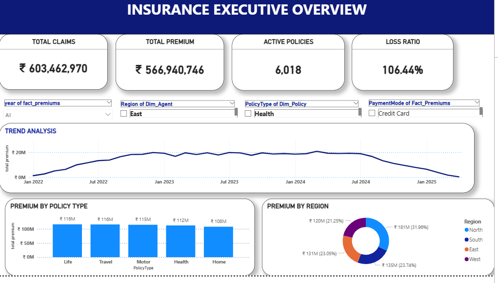
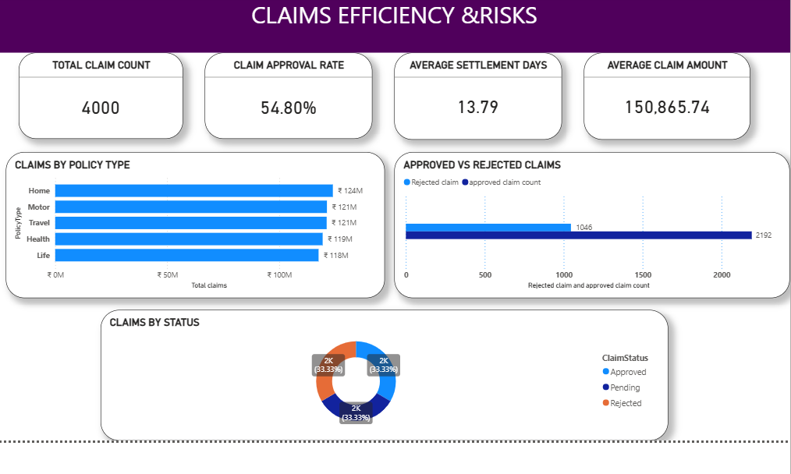
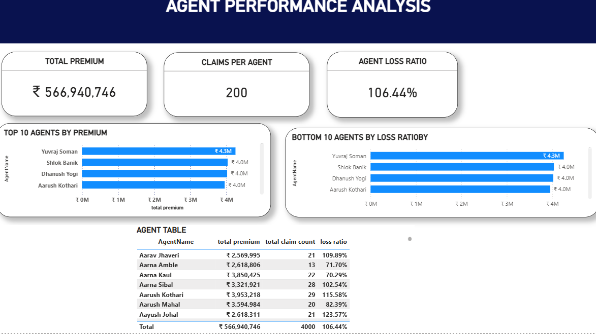

# Insurance Data Analysis Dashboard

## Project Overview
This project analyzes insurance policy, claim, and customer data using SQL, Excel, and Power BI. The dashboard provides insights into policy performance, claims, risk assessment, and customer retention.

## Tools Used
- SQL
- Microsoft Excel
- Power BI

## Key KPIs
- Total Policies
- Total Premium Amount
- Total Claim Amount
- Loss Ratio
- High Risk Policies %
- Policies Lapsed Rate %
- Active vs Lapsed Policies

## Dashboard Pages

### Page 1: Executive Summary
Overall insurance performance and key business metrics.

### Page 2: Claims Analysis
Claim trends, claim amounts, and policy-wise claim performance.

### Page 3: Customer Analysis
Customer demographics, retention, and policy distribution.

### Page 4: Risk & Retention Analysis
- High Risk Policies %
- Policies Lapsed Rate %
- Premium vs Claim by Region
- Loss Ratio by Policy Type
- Active vs Lapsed Policies Over Time

## Files
- project work powerbi_v2.pbix

## Author
Mamatha puppala

## Dashboard Screenshots

### Dashboard 1

### Dashboard 2

### Dashboard 3

### Dashboard 4
![Dashboard 4](Screenshot 2026-07-10 222928.png
